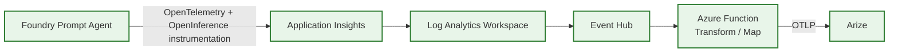
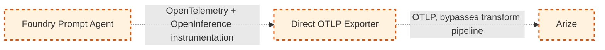

# Copilot Coding Agent — Squad Instructions

You are working on a project that uses **Squad**, an AI team framework. When picking up issues autonomously, follow these guidelines.

## Coordinator Canary Check

**IMPORTANT — run this check on EVERY session start, before doing any work:**

Inspect your `agent_instructions` for the coordinator canaries. This is a **two-state payload-integrity check within a known Squad coordinator session**; it verifies whether the coordinator payload loaded fully or was visibly truncated. It is **not** proof that an agent with no canaries is safely non-Squad — wholly absent payloads and proven non-Squad agents require a host-level identity beacon before custom-agent instruction ingestion.

1. If the HEAD canary `SQUAD_COORDINATOR_CANARY_HEAD_b7d2` is **absent**, the Squad coordinator payload is not observable from inside this prompt. Treat non-Squad discrimination as an **OPEN host-level concern**; do not claim this check proved the current agent is non-Squad.
2. If the HEAD canary `SQUAD_COORDINATOR_CANARY_HEAD_b7d2` is **present** and the EOF canary `SQUAD_COORDINATOR_CANARY_a8f3` is **present**, the coordinator prompt loaded fully. Proceed with normal Squad behavior.
3. If the HEAD canary `SQUAD_COORDINATOR_CANARY_HEAD_b7d2` is **present** but the EOF canary `SQUAD_COORDINATOR_CANARY_a8f3` is **absent**, the coordinator prompt loaded but was **truncated** before the end.

**When the coordinator prompt is truncated, you MUST:**
1. **STOP** — do not proceed with standard Squad behavior.
2. **WARN the user** with this exact message:
   ```
   ⚠️ Squad coordinator (squad.agent.md) loaded but appears to be truncated before the EOF canary. Do NOT proceed with standard Squad behavior — Squad's safety rails are incomplete. Please restart your session.
   ```
3. Do not continue with normal Squad routing, spawning, PR, or branch-protection behavior after emitting the warning.

## Team Context

Before starting work on any issue:

1. Read `.squad/team.md` for the team roster, member roles, and your capability profile.
2. Read `.squad/routing.md` for work routing rules.
3. If the issue has a `squad:{member}` label, read that member's charter at `.squad/agents/{member}/charter.md` to understand their domain expertise and coding style — work in their voice.

## Capability Self-Check

Before starting work, check your capability profile in `.squad/team.md` under the **Coding Agent → Capabilities** section.

- **🟢 Good fit** — proceed autonomously.
- **🟡 Needs review** — proceed, but note in the PR description that a squad member should review.
- **🔴 Not suitable** — do NOT start work. Instead, comment on the issue:
  ```
  🤖 This issue doesn't match my capability profile (reason: {why}). Suggesting reassignment to a squad member.
  ```

## Branch Naming

Use the squad branch convention:
```
squad/{issue-number}-{kebab-case-slug}
```
Example: `squad/42-fix-login-validation`

## PR Guidelines

When opening a PR:
- Reference the issue: `Closes #{issue-number}`
- If the issue had a `squad:{member}` label, mention the member: `Working as {member} ({role})`
- If this is a 🟡 needs-review task, add to the PR description: `⚠️ This task was flagged as "needs review" — please have a squad member review before merging.`
- Follow any project conventions in `.squad/decisions.md`

## Decisions

If you make a decision that affects other team members, write it to:
```
.squad/decisions/inbox/copilot-{brief-slug}.md
```
The Scribe will merge it into the shared decisions file.

---

# Project Architecture & Conventions — foundry-otel-to-arize-demo

Everything below this line is project-specific guidance for `foundry-otel-to-arize-demo`. It applies to every contributor — human, Squad member, or Copilot coding agent.

## 1. Repository Purpose and Customer Scenario

This repository is a **reusable observability demo** showing how to instrument a **Microsoft Foundry Prompt Agent** end-to-end with OpenTelemetry/OpenInference, capture the resulting telemetry in **Application Insights**, transform and forward it, and visualize/correlate traces, spans, and token usage in **Arize**.

- **Audience:** Enterprise healthcare customers evaluating observability for Foundry Prompt Agents (e.g., UnitedHealth Group, CVS Health, Elevance Health). Content must read as credible and reusable across any healthcare enterprise, not tied to one named customer's real environment.
- **Data policy — synthetic data only, everywhere:** Every prompt, response, trace payload, screenshot, log line, and demo script in this repo MUST use synthetic/fabricated data. **Never** include real patient data, real PII/PHI, real member IDs, real claims data, or any real customer-identifying information, in code, docs, tests, issues, or commit history.
- **Goal of the repo:** Let a field engineer clone this repo, deploy the current-state pipeline, run the demo, and credibly explain both what's validated today and what's proposed for the future — without guessing.

## 2. Current-State Architecture (Validated, Implemented)

This is the **only** architecture that should be described as "working" or "validated." It is implemented under `/src` and `/infra`.



**Flow description:**
1. The Foundry Prompt Agent emits spans/traces using OpenTelemetry, with LLM-specific attributes following OpenInference semantic conventions.
2. Telemetry lands in Application Insights (and its backing Log Analytics workspace).
3. Log Analytics streams relevant telemetry to an Event Hub.
4. An Azure Function consumes the Event Hub stream, transforms/maps the schema, and forwards it to Arize via OTLP.
5. Arize ingests, correlates, and visualizes traces, spans, and token usage.

Trace ID, span ID, parent span ID, and correlation ID must be preserved at every hop in this chain wherever technically possible (see §10).

## 3. Future-State Architecture (CONCEPTUAL — NOT YET IMPLEMENTED)

> ⚠️ **CONCEPTUAL — NOT YET IMPLEMENTED.** Nothing in this section exists in `/src` or `/infra`. Design assets for this architecture live only under `/docs/future-state`. Do not implement this path without an accepted `architecture-decision` issue and an explicit change to this document.



**Intent:** Export OTLP directly from the Prompt Agent (or a lightweight sidecar) straight to Arize, removing the Application Insights → Log Analytics → Event Hub → Azure Function hop. This is a **proposal**, contingent on product/platform support for direct OTLP export from Foundry Prompt Agents and is **not validated**. Any issue or doc describing this path must carry the "CONCEPTUAL — NOT IMPLEMENTED" label per §16.

## 4. Expected Repository Structure

```
/
├── .github/                      # Issue templates, PR template, workflows, copilot-instructions.md (this file)
├── .squad/                       # Squad team framework (charters, routing, decisions) — not product code
├── src/
│   ├── prompt-agent/              # Foundry Prompt Agent implementation + OTel/OpenInference instrumentation (CURRENT-STATE)
│   └── telemetry-pipeline/        # Azure Function transform/mapping code, Event Hub consumers (CURRENT-STATE)
├── infra/
│   ├── bicep/                     # Bicep modules (preferred IaC) — App Insights, Log Analytics, Event Hub, Function, Key Vault (CURRENT-STATE)
│   └── terraform/                 # Optional Terraform alternative, mirrors bicep/ module boundaries (CURRENT-STATE)
├── docs/
│   ├── current-state/             # Architecture docs, runbooks, diagrams for what is implemented and validated
│   ├── future-state/              # Conceptual direct-OTLP design docs, diagrams, proposals — NEVER implementation code
│   └── adr/                       # Architecture Decision Records (process, template, numbered decisions)
├── tests/
│   ├── telemetry-mapping/         # Tests validating Event Hub → Function → Arize schema mapping
│   └── export/                    # Tests validating OTLP export behavior
├── demo/                          # Demo scripts, synthetic prompts/transcripts, narrated walkthrough assets
└── README.md
```

**Hard rule:** Current-state code lives under `/src` and `/infra` only. Future-state (conceptual) assets live under `/docs/future-state` only. Never mix the two — a future-state idea does not get a stub, placeholder, or partial implementation under `/src` or `/infra` until it has gone through an accepted architecture-decision issue and this document has been updated to describe it as current-state.

## 5. Preferred Languages and Frameworks

- **Foundry Prompt Agent:** Python preferred (idiomatic for the Microsoft Foundry Prompt Agents SDK and the broader OpenTelemetry/OpenInference Python ecosystem). TypeScript or C# are acceptable alternatives where they better match an existing Foundry SDK surface — pick one per component and stay consistent within that component.
- **Telemetry transform pipeline:** Azure Functions, consistent with the Prompt Agent's language choice where practical (Python or C# isolated worker; TypeScript acceptable for Node-based Functions).
- **Infrastructure-as-Code:** Bicep is preferred. Terraform is an acceptable alternative where a team already maintains Terraform elsewhere — do not mix both for the same resource.

## 6. Infrastructure-as-Code Conventions

- Organize Bicep as composable **modules** (one module per resource type or tightly coupled resource group, e.g. `app-insights.bicep`, `event-hub.bicep`, `function-app.bicep`, `key-vault.bicep`).
- **Parameterize** environment, region, naming prefixes, and SKUs — no hardcoded resource names or environment-specific values in module bodies.
- Deploys must be **idempotent**: re-running a deployment with the same parameters must not fail or duplicate resources. Validate with `az deployment ... what-if` (or `terraform plan`) before merge.
- Every module must apply the required tags (see §7) and follow the naming convention (see §7).
- No secrets as Bicep parameters in plaintext — reference Key Vault via `getSecret()` / secure parameters only.

## 7. Azure Naming and Tagging Conventions

**Naming pattern:** `{project}-{env}-{resourceType}-{region}`
Example: `fotoa-demo-func-eastus2`, `fotoa-dev-kv-eastus2`.

- `{project}`: short project token (e.g. `fotoa` for foundry-otel-to-arize-demo)
- `{env}`: `dev`, `demo`, `prod` (this repo is expected to primarily use `dev`/`demo`)
- `{resourceType}`: abbreviated resource type (e.g. `func`, `kv`, `ehns`, `appi`, `law`)
- `{region}`: short Azure region token (e.g. `eastus2`)

**Required tags** on every provisioned resource:
| Tag | Purpose |
|---|---|
| `environment` | dev / demo / prod |
| `owner` | responsible team/individual |
| `project` | `foundry-otel-to-arize-demo` |
| `costCenter` | cost allocation tag |
| `dataClassification` | must be `synthetic` for all demo data resources in this repo — never `phi`/`pii` |

## 8. Security and Secrets Management

- **Never commit credentials, connection strings, API keys, or tokens** to this repository, in code, config, docs, issues, or commit messages.
- Use **Azure Key Vault** for all secrets (Application Insights connection strings, Event Hub connection details, Arize API keys, etc.).
- **Prefer managed identities** (system- or user-assigned) for service-to-service auth wherever Azure supports it. If a resource/service doesn't support managed identity, document the exception explicitly in the relevant infra issue/PR.
- Never log sensitive healthcare or personally identifiable information. Since this repo uses synthetic data only, this also means: never introduce real data "just for testing" — synthetic data must look plausible without being real.

## 9. OpenTelemetry and OpenInference Conventions

- Instrument the Prompt Agent using OpenTelemetry SDKs with **OpenInference semantic conventions** for LLM spans (e.g., `llm.model_name`, `llm.token_count.prompt`, `llm.token_count.completion`, `llm.prompts`, `llm.invocation_parameters`, `openinference.span.kind`).
- Span naming should reflect the logical operation (e.g., `prompt_agent.invoke`, `llm.chat_completion`, `retriever.query`), not internal function names.
- Required span attributes at minimum: trace ID, span ID, parent span ID, operation name, model identifier, token usage (prompt/completion/total), and a correlation ID that ties the span back to the originating demo request.
- Do not put PII/PHI or real customer content into span attributes — synthetic prompts/responses only.

## 10. Application Insights Telemetry Expectations

- Application Insights must capture the full span/trace graph emitted by the Prompt Agent's OpenTelemetry instrumentation, including custom dimensions for OpenInference attributes (model, token counts, correlation ID).
- Custom dimensions should be named consistently with the OpenInference attribute keys where possible, to minimize transform complexity downstream.
- Avoid emitting verbose/raw prompt-and-response bodies into Application Insights custom dimensions unless they are synthetic and clearly size-bounded for the demo.

## 11. Arize OTLP Integration Expectations

- The Azure Function transform step must map Application Insights/Log Analytics telemetry schema into valid OTLP spans Arize can ingest, preserving trace/span/parent-span IDs and token-usage attributes.
- Any schema mapping gaps (fields that can't be preserved end-to-end) must be documented, not silently dropped.
- Arize-side dashboards/queries used in the demo should be described in `/docs/current-state`, with instructions reproducible from synthetic data only.

## 12. Trace and Span Correlation Requirements

**Trace ID, span ID, parent span ID, and correlation ID must be preserved end-to-end wherever technically possible** — from the Prompt Agent, through Application Insights, Log Analytics, Event Hub, the Azure Function transform, and into Arize. Where a hop cannot preserve one of these identifiers (e.g., a platform limitation), this must be explicitly documented as a known limitation in `/docs/current-state`, not silently accepted.

## 13. Token-Usage Telemetry Requirements

- Prompt, completion, and total token counts must be captured as span attributes at the point of LLM invocation and preserved through every stage of the pipeline to Arize.
- Token-usage figures in demo material must come from synthetic invocations only — never real customer usage data.

## 14. Error-Handling and Retry Conventions

- Prompt Agent and transform pipeline code must handle transient failures (throttling, timeouts, transient 5xx) with bounded retries and exponential backoff; do not retry indefinitely.
- Failures must still emit telemetry (error status on the relevant span) rather than silently dropping the trace.
- Document any non-retryable failure modes and their expected operator action in `/docs/current-state`.

## 15. Testing Requirements

- **Telemetry mapping and export tests are required** for any change touching the Event Hub → Azure Function → Arize transform path (schema mapping correctness, trace/span ID preservation, token-usage field preservation).
- Tests live under `/tests/telemetry-mapping` and `/tests/export`.
- Use synthetic fixtures only — no real telemetry captures from production systems.

## 16. Documentation Requirements

- Update `/docs/current-state` whenever implemented architecture or behavior changes.
- Update `/docs/future-state` whenever a conceptual design changes — but never let future-state docs imply something is implemented.
- Every future-state/conceptual document must carry an explicit **"CONCEPTUAL — NOT IMPLEMENTED"** label near the top.
- Clearly label assumptions, limitations, and unvalidated behavior in every architecture doc — do not let a reader infer validation that hasn't happened.

## 17. Mermaid Diagram Conventions

- **Current-state diagrams:** solid lines, solid boxes, normal styling (see §2 example).
- **Future-state/conceptual diagrams:** must be visually distinguished — use dashed edges (`-.->`) and/or dashed-border styling (`stroke-dasharray`), and must include an explicit **"CONCEPTUAL — NOT IMPLEMENTED"** text label in or immediately above the diagram (see §3 example).
- Never reuse current-state diagram styling for a future-state diagram, even as a draft.

## 18. GitHub Issue and Pull-Request Expectations

- Use the issue templates in `.github/ISSUE_TEMPLATE/`: `architecture-decision.yml`, `feature.yml`, `future-state-proposal.yml`, `infrastructure.yml`, `telemetry-mapping.yml`, `bug-report.yml`, `demo-validation.yml`. Pick the template matching the work's architecture track; use `future-state-proposal.yml` for anything conceptual.
- Use the `.github/pull_request_template.md` for every PR — it requires explicit confirmation that current-state/future-state claims are correctly labeled, no secrets or sensitive data were added, tests pass, and docs are updated.
- Architecture decisions with cross-track impact should be raised as `architecture-decision.yml` issues before implementation begins.

## 19. Non-Negotiable Instructions for Copilot and Squad

When working in this repository, Copilot (and every Squad member) MUST:

1. Never commit credentials, API keys, or connection strings.
2. Use Azure Key Vault for all secrets.
3. Prefer managed identities wherever Azure supports them.
4. Avoid logging sensitive healthcare or personally identifiable information.
5. Use synthetic data in all demonstrations, tests, docs, and issues — never real PII/PHI.
6. Keep validated (current-state) capabilities separate from conceptual (future-state) designs, in both code location (`/src`,`/infra` vs `/docs/future-state`) and in prose.
7. Clearly label assumptions, limitations, and unvalidated behavior in every architecture artifact.
8. Preserve trace IDs, span IDs, parent span IDs, and correlation IDs whenever technically possible across the full pipeline.
9. Include meaningful tests for telemetry mapping and export behavior when touching that code path.
10. Update documentation whenever architecture or implementation behavior changes.
