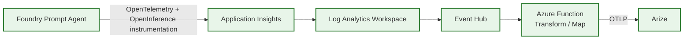
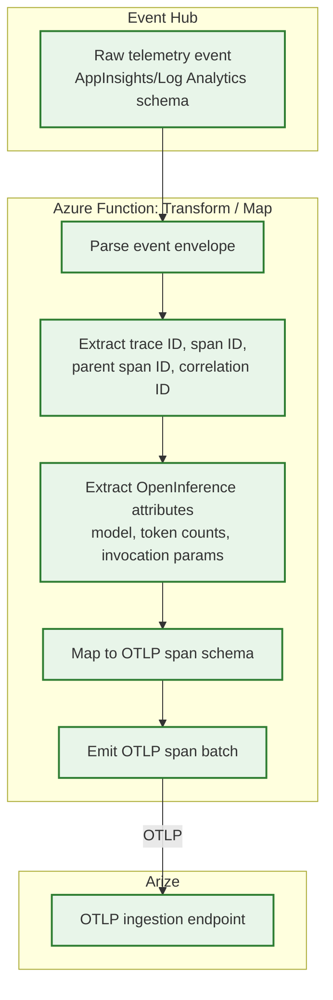

# Current-State Architecture

**Status: CURRENT-STATE (validated, implemented).** Everything described and diagrammed on this
page exists under `/src` and `/infra` and has been validated end-to-end with synthetic data. For
the conceptual direct-OTLP proposal, see [`/docs/future-state`](../future-state/README.md) instead
— it is **not** implemented and must never be confused with this page.

This diagram set is the authoritative current-state picture referenced from the root
[`README.md`](../../README.md) and must stay in sync with
[`/.github/copilot-instructions.md`](../../.github/copilot-instructions.md) §2.

## End-to-End Pipeline

**Flow description:**
1. The Foundry Prompt Agent emits spans/traces using OpenTelemetry, with LLM-specific attributes
   following OpenInference semantic conventions (model name, prompt/completion token counts,
   invocation parameters).
2. Telemetry lands in Application Insights (and its backing Log Analytics workspace).
3. Log Analytics streams relevant telemetry to an Event Hub.
4. An Azure Function consumes the Event Hub stream, transforms/maps the schema, and forwards it to
   Arize via OTLP.
5. Arize ingests, correlates, and visualizes traces, spans, and token usage.

Trace ID, span ID, parent span ID, and correlation ID are preserved at every hop in this chain
wherever technically possible (see §12 of `copilot-instructions.md`). Any hop that cannot preserve
one of these identifiers is called out explicitly below under "Known Limitations," never silently
dropped.

## Zoomed View: Event Hub → Azure Function Transform

This is the schema-mapping step with the highest risk of field loss, so it is broken out
separately. The Azure Function consumes raw Log Analytics/Application Insights telemetry events
from the Event Hub, maps them into valid OTLP spans, and forwards the result to Arize.

**Mapping notes:**
- Trace ID, span ID, and parent span ID are read from the incoming Application Insights
  `operation_Id` / `operation_ParentId` custom dimensions and mapped directly onto the
  corresponding OTLP span context fields.
- The correlation ID (a custom dimension set by the Prompt Agent at invocation time) is mapped onto
  an OTLP span attribute so it survives into Arize for cross-system correlation.
- Prompt/completion/total token counts are mapped onto OTLP span attributes using the same
  OpenInference-aligned attribute keys emitted by the Prompt Agent, to minimize transform
  complexity (see §10 of `copilot-instructions.md`).

## Known Limitations

- This page documents the mapping behavior above as implemented; any field that cannot be
  preserved end-to-end through a given Azure platform limitation must be added to this list
  explicitly as it is discovered during Telemetry Pipeline validation (Milestone 2). None are
  currently known to be dropped, but this has not yet been exhaustively validated against every
  Application Insights telemetry type.
- Diagram styling follows the solid-line/solid-box convention for current-state diagrams only (see
  `copilot-instructions.md` §17). It must never be reused for future-state/conceptual diagrams.
