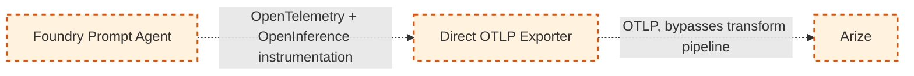

# Future-State: Direct OTLP Export

> ⚠️ **CONCEPTUAL — NOT IMPLEMENTED.** Everything on this page is a design proposal, not working
> code. Nothing described here exists under `/src` or `/infra`. Do not implement any part of this
> design without an accepted `architecture-decision` issue and an explicit update to
> `/.github/copilot-instructions.md` §2/§3 reclassifying it as current-state. See
> [`/docs/future-state/README.md`](README.md) and
> [`/docs/current-state/architecture.md`](../current-state/architecture.md) for the validated
> pipeline this proposal would replace.

## Proposed Capability

Export OTLP directly from the Foundry Prompt Agent (or a lightweight sidecar process running
alongside it) straight to Arize, removing the Application Insights → Log Analytics → Event Hub →
Azure Function transform hop entirely from the telemetry path.

## Current Limitation

The validated current-state pipeline (`/docs/current-state/architecture.md`) requires four
intermediate hops between span emission and Arize ingestion: Application Insights, Log Analytics,
Event Hub, and an Azure Function transform step. Each hop adds operational surface area (an
Azure Function to maintain, an Event Hub to provision and monitor, a schema-mapping step that must
be kept in sync with both Application Insights' telemetry schema and Arize's OTLP ingestion
schema) and latency between when a span is emitted and when it's visible in Arize. For a customer
evaluating a long-term observability strategy, this is reasonably seen as more infrastructure than
the core value (OpenTelemetry spans visible in Arize) strictly requires.

## Target Architecture

**Intent:** The Prompt Agent's existing OpenTelemetry SDK instrumentation (spans, OpenInference
attributes, correlation ID — all already implemented in the current-state Prompt Agent, see
`src/prompt-agent/README.md`) is unchanged. Only the *exporter* configuration changes: instead of
(or in addition to) the Azure Monitor exporter that sends spans to Application Insights, an OTLP
exporter is configured to send spans directly to Arize's OTLP ingestion endpoint — either in-process
in the Prompt Agent, or via a lightweight sidecar process (e.g. an OpenTelemetry Collector instance)
running alongside it. Application Insights, Log Analytics, Event Hub, and the Azure Function
transform are removed from the telemetry path entirely.

Contrast with the current-state diagram: solid boxes/edges there mean validated and implemented;
dashed boxes/edges here mean conceptual and unvalidated, per
`/.github/copilot-instructions.md` §17.

## Expected Benefit

- **Fewer operational hops:** no Event Hub or Azure Function to provision, monitor, or keep
  schema-synchronized with Arize's ingestion contract.
- **Lower latency to visibility:** a span could appear in Arize within one hop of being emitted,
  instead of traversing four systems first.
- **Smaller schema-mapping surface:** nothing needs to translate Application
  Insights/Log Analytics' telemetry schema into OTLP — the Prompt Agent already emits
  OpenTelemetry-native spans, so an OTLP exporter speaks Arize's native ingestion format directly.
- **Simpler customer story for a from-scratch Foundry deployment** that doesn't already have an
  Application Insights investment to build on.

These are expected/intended benefits of the proposal, not measured outcomes — nothing above has
been benchmarked or validated (see Validation Status below).

## Product Dependency

This design depends on OTLP export support existing (or being added) somewhere in the Foundry
Prompt Agent hosting environment, and on network/security posture allowing that environment to call
an external OTLP endpoint directly. See
[`/docs/future-state/dependencies.md`](dependencies.md) for the full living tracking table of
specific product/platform dependencies, their status, and cited sources (issue #64). Headline
findings as of 2026-10-03: Arize's OTLP ingestion endpoint is confirmed-available per Arize's own
docs; whether this repo's specific Prompt Agent product surface (as opposed to the related but
distinct "hosted agent" surface Microsoft documents) supports a custom OTLP exporter is unconfirmed.

## Assumptions

Every assumption below is unvalidated unless otherwise stated; none should be read as implemented
or confirmed behavior.

1. **The Foundry Prompt Agent hosting environment permits outbound network calls to Arize's public
   OTLP ingestion endpoint.** Not validated — depends on the customer's network egress policy and
   whatever hosting model the Prompt Agent ultimately runs on (not yet finalized even for
   current-state — see `infra/modules/networking.bicep` and issue #21 for the current-state
   baseline-public-access-plus-optional-private-endpoint model, which this proposal has not been
   checked against).
2. **An OTLP exporter (in-process or sidecar) can authenticate to Arize without storing a
   long-lived secret in Prompt Agent code or config.** Not validated — current-state secrets
   handling relies on Key Vault + managed identity for Azure-to-Azure calls (`copilot-instructions.md`
   §8); Arize is not an Azure resource, so managed identity does not apply, and the
   secrets-handling story for a direct Arize API key is an open question, not an assumed solved
   problem.
3. **Removing the Event Hub/Function hop does not remove useful operational signal.** The
   current-state Function emits its own Application Insights telemetry about export
   success/failure (capability matrix #11, `docs/architecture/capability-matrix.md`). This
   proposal has not yet identified a replacement mechanism for operator-facing export-health
   visibility if the Function is removed — assumed to need one, not assumed to be free.
4. **A lightweight sidecar (e.g. OpenTelemetry Collector) is a viable deployment unit in whatever
   compute hosts the Prompt Agent.** Not validated against any specific Foundry Prompt Agent
   hosting target.
5. **Trace/span/parent-span/correlation-ID preservation is assumed to be simpler with fewer hops,
   but this is explicitly not asserted as automatically better** — see the dedicated risk
   assessment below (tracked under issue #65).

## Risks

- **Platform support risk:** if Foundry Prompt Agents cannot run a sidecar process or add a custom
  OTLP exporter in their hosting environment, this design is not implementable as described and
  would need a different mechanism (e.g. a managed OTLP forwarding feature, if one is ever
  offered).
- **Security posture risk:** sending telemetry directly to an external (non-Azure) endpoint changes
  the network/data-exfiltration risk profile compared to today's all-Azure-resource pipeline, and
  changes how an Arize API credential must be secured without Key Vault + managed identity as a
  clean fit.
- **Loss of Application Insights/Log Analytics as an independent telemetry store:** today, Azure
  Monitor retains telemetry even if Arize ingestion fails; a direct-export-only design has no
  equivalent fallback store unless one is deliberately added back in.
- **Trace/correlation-ID preservation risk:** a dedicated risk-assessment section is tracked under
  issue #65 and will be added to this document as a follow-on section — not assumed solved by
  having fewer hops.
- **Operational observability gap:** see Assumption 3 above — no replacement signal yet identified
  for current-state's Function-level export success/failure telemetry.

## Validation Status

**Not validated — concept only.** No spike, proof-of-concept, or vendor confirmation has been
performed for any part of this design. Every claim above is a proposal or an explicitly-flagged
assumption, not a tested result.

## Acceptance Criteria (from issue #63)

- [x] Doc lives under `/docs/future-state/direct-otlp.md`
- [x] "CONCEPTUAL — NOT IMPLEMENTED" label present near the top
- [x] Dashed-line Mermaid diagram included, styled per `copilot-instructions.md` future-state conventions
- [x] Explicit list of product/platform dependencies not yet confirmed (summarized above; full
      tracking table committed as `/docs/future-state/dependencies.md`, issue #64)
