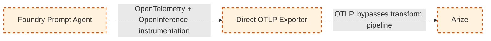

# Future-State: Direct OTLP Export

> ⚠️ **CONCEPTUAL — NOT IMPLEMENTED.** Everything on this page is a design proposal, not working
> code. Nothing described here exists under `/src` or `/infra`. Do not implement any part of this
> design without an accepted `architecture-decision` issue and an explicit update to
> `/.github/copilot-instructions.md` §2/§3 reclassifying it as current-state. See
> [`/docs/future-state/README.md`](README.md) and
> [`/docs/current-state/architecture.md`](../current-state/architecture.md) for the validated
> pipeline this proposal would replace.

## Proposed Capability

Export OTLP directly from the Foundry Prompt Agent (or a lightweight sidecar process running
alongside it) straight to Arize, removing the Application Insights → Log Analytics → Event Hub →
Azure Function transform hop entirely from the telemetry path.

## Current Limitation

The validated current-state pipeline (`/docs/current-state/architecture.md`) requires four
intermediate hops between span emission and Arize ingestion: Application Insights, Log Analytics,
Event Hub, and an Azure Function transform step. Each hop adds operational surface area (an
Azure Function to maintain, an Event Hub to provision and monitor, a schema-mapping step that must
be kept in sync with both Application Insights' telemetry schema and Arize's OTLP ingestion
schema) and latency between when a span is emitted and when it's visible in Arize. For a customer
evaluating a long-term observability strategy, this is reasonably seen as more infrastructure than
the core value (OpenTelemetry spans visible in Arize) strictly requires.

## Target Architecture

**Intent:** The Prompt Agent's existing OpenTelemetry SDK instrumentation (spans, OpenInference
attributes, correlation ID — all already implemented in the current-state Prompt Agent, see
`src/prompt-agent/README.md`) is unchanged. Only the *exporter* configuration changes: instead of
(or in addition to) the Azure Monitor exporter that sends spans to Application Insights, an OTLP
exporter is configured to send spans directly to Arize's OTLP ingestion endpoint — either in-process
in the Prompt Agent, or via a lightweight sidecar process (e.g. an OpenTelemetry Collector instance)
running alongside it. Application Insights, Log Analytics, Event Hub, and the Azure Function
transform are removed from the telemetry path entirely.

Contrast with the current-state diagram: solid boxes/edges there mean validated and implemented;
dashed boxes/edges here mean conceptual and unvalidated, per
`/.github/copilot-instructions.md` §17.

## Expected Benefit

- **Fewer operational hops:** no Event Hub or Azure Function to provision, monitor, or keep
  schema-synchronized with Arize's ingestion contract.
- **Lower latency to visibility:** a span could appear in Arize within one hop of being emitted,
  instead of traversing four systems first.
- **Smaller schema-mapping surface:** nothing needs to translate Application
  Insights/Log Analytics' telemetry schema into OTLP — the Prompt Agent already emits
  OpenTelemetry-native spans, so an OTLP exporter speaks Arize's native ingestion format directly.
- **Simpler customer story for a from-scratch Foundry deployment** that doesn't already have an
  Application Insights investment to build on.

These are expected/intended benefits of the proposal, not measured outcomes — nothing above has
been benchmarked or validated (see Validation Status below).

## Product Dependency

This design depends on OTLP export support existing (or being added) somewhere in the Foundry
Prompt Agent hosting environment, and on network/security posture allowing that environment to call
an external OTLP endpoint directly. See
[`/docs/future-state/dependencies.md`](dependencies.md) for the full living tracking table of
specific product/platform dependencies, their status, and cited sources (issue #64). Headline
findings as of 2026-10-03: Arize's OTLP ingestion endpoint is confirmed-available per Arize's own
docs; whether this repo's specific Prompt Agent product surface (as opposed to the related but
distinct "hosted agent" surface Microsoft documents) supports a custom OTLP exporter is unconfirmed.

## Assumptions

Every assumption below is unvalidated unless otherwise stated; none should be read as implemented
or confirmed behavior.

1. **The Foundry Prompt Agent hosting environment permits outbound network calls to Arize's public
   OTLP ingestion endpoint.** Not validated — depends on the customer's network egress policy and
   whatever hosting model the Prompt Agent ultimately runs on (not yet finalized even for
   current-state — see `infra/modules/networking.bicep` and issue #21 for the current-state
   baseline-public-access-plus-optional-private-endpoint model, which this proposal has not been
   checked against).
2. **An OTLP exporter (in-process or sidecar) can authenticate to Arize without storing a
   long-lived secret in Prompt Agent code or config.** Not validated — current-state secrets
   handling relies on Key Vault + managed identity for Azure-to-Azure calls (`copilot-instructions.md`
   §8); Arize is not an Azure resource, so managed identity does not apply, and the
   secrets-handling story for a direct Arize API key is an open question, not an assumed solved
   problem.
3. **Removing the Event Hub/Function hop does not remove useful operational signal.** The
   current-state Function emits its own Application Insights telemetry about export
   success/failure (capability matrix #11, `docs/architecture/capability-matrix.md`). This
   proposal has not yet identified a replacement mechanism for operator-facing export-health
   visibility if the Function is removed — assumed to need one, not assumed to be free.
4. **A lightweight sidecar (e.g. OpenTelemetry Collector) is a viable deployment unit in whatever
   compute hosts the Prompt Agent.** Not validated against any specific Foundry Prompt Agent
   hosting target.
5. **Trace/span/parent-span/correlation-ID preservation is assumed to be simpler with fewer hops,
   but this is explicitly not asserted as automatically better** — see the dedicated "Trace and
   Correlation-ID Preservation Risk Assessment" section below (issue #65).

## Risks

- **Platform support risk:** if Foundry Prompt Agents cannot run a sidecar process or add a custom
  OTLP exporter in their hosting environment, this design is not implementable as described and
  would need a different mechanism (e.g. a managed OTLP forwarding feature, if one is ever
  offered).
- **Security posture risk:** sending telemetry directly to an external (non-Azure) endpoint changes
  the network/data-exfiltration risk profile compared to today's all-Azure-resource pipeline, and
  changes how an Arize API credential must be secured without Key Vault + managed identity as a
  clean fit.
- **Loss of Application Insights/Log Analytics as an independent telemetry store:** today, Azure
  Monitor retains telemetry even if Arize ingestion fails; a direct-export-only design has no
  equivalent fallback store unless one is deliberately added back in.
- **Trace/correlation-ID preservation risk:** see the dedicated "Trace and Correlation-ID
  Preservation Risk Assessment" section below (issue #65) — not assumed solved by having fewer
  hops.
- **Operational observability gap:** see Assumption 3 above — no replacement signal yet identified
  for current-state's Function-level export success/failure telemetry.

## Trace and Correlation-ID Preservation Risk Assessment

> This section exists because "fewer hops" is **not** a synonym for "better correlation
> preservation." A design with fewer integration points has fewer places where an identifier
> *could* be dropped, but that is a structural observation, not a verified outcome. Nothing below
> should be read as a claim that the direct-OTLP path has already been confirmed to preserve
> correlation better (or worse) than current-state — it has not been tested at all (see
> Validation Status).

### Identifiers in scope

Per `/.github/copilot-instructions.md` §12, the identifiers that must be preserved end-to-end are:
trace ID, span ID, parent span ID, and correlation ID (the demo-request-level ID that ties a span
back to its originating synthetic request, distinct from the OTel trace ID itself).

### Current-state baseline: what is actually documented today

Before assessing the future-state path, this section needed a validated current-state baseline to
compare against, per issue #65's validation steps ("Fact Checker review against current-state
correlation-ID handling (#11 diagram, #37 preservation proof) to ensure no inconsistency").
That check surfaced a gap worth stating plainly: **issue #37** ("Trace/span/parent-span/
correlation-ID preservation across Event Hub and Function hops") is closed, but a repo-wide search
of `/docs/current-state` and `/src/telemetry-pipeline` found no committed conversion-logic
documentation, round-trip test evidence, or KQL/Arize query results matching #37's acceptance
criteria. This is consistent with the drift already flagged in issues #60/#14 (`src/telemetry-pipeline/README.md`
describes transform code that does not exist in the repository) — it is not a new, separate
finding, but it does mean this risk assessment has **no validated current-state identifier-mapping
document to cross-reference**, only the pipeline's architectural shape
(`/docs/current-state/architecture.md`) and the §12 *requirement* that identifiers be preserved.
Given that, the comparisons below are framed as "fewer structural opportunities for loss" rather
than "verified improvement over a proven baseline" — there is no proven current-state baseline
artifact to improve upon yet, only a documented intent.

### Per-identifier assessment

| Identifier | Current-state (4 hops: App Insights → Log Analytics → Event Hub → Function → Arize) | Direct-OTLP future-state (1 hop: Agent/sidecar → Arize) | Assumed-preserved or unverified? |
|---|---|---|---|
| Trace ID | Required by §12 to survive every hop; App Insights' `operation_Id` (32-hex GUID-like) must be losslessly converted to a 16-byte OTel trace ID at the Function transform step per issue #37 — **no committed conversion-logic doc or test evidence found** (see above). | No App Insights/`operation_Id` conversion step exists in this design at all — the Prompt Agent's native OTel trace ID is passed directly to the OTLP exporter, with no intermediate schema translation. | **Unverified.** Removing the Application-Insights-format conversion step removes one specific, named risk (lossy `operation_Id` ↔ OTel trace ID mapping) by construction, since that conversion never happens in this path. That is a real structural difference, but "the conversion risk doesn't exist in this design" is not the same as "this design has been shown to preserve trace IDs" — no implementation exists to test. |
| Span ID | Same per-hop requirement; subject to whatever the Function transform does with OTel span IDs when mapping into Arize's OTLP schema. | OTel span IDs are passed through an OTLP exporter configuration change only — the Prompt Agent's own span-ID generation (already implemented, see `src/prompt-agent/README.md`) is unchanged. | **Unverified.** No OTLP exporter has been implemented or tested in this design; "exporter config only" is an architectural assumption (Assumption-level), not a tested result. |
| Parent span ID | Same per-hop requirement; parent/child linkage must survive Event Hub partitioning/batching and the Function's transform (explicit risk named in issue #37's acceptance criteria). | No Event Hub partitioning/batching step exists in this design — spans are exported directly, removing one named class of risk (batching/reordering across Event Hub partitions). | **Unverified**, for the same reason as trace ID above: removing a named risk by removing the hop that carries it is a structural observation, not a validated outcome, since no implementation or test has been run. |
| Correlation ID (demo-request-level) | Must be carried as a span attribute per §9/§12; current-state's custom-dimension mapping from Application Insights into the Function's OTLP output is the step where this could be dropped or renamed. | Carried as a span attribute at emission time (Prompt Agent, already implemented) with no intermediate schema remapping step in this design. | **Unverified.** Same reasoning: fewer schema-translation steps is a smaller surface for the attribute to be dropped or renamed, but "smaller surface" ≠ "verified preserved." |

### Why "fewer hops" is not asserted as "automatically better"

The per-identifier pattern above is consistent: direct-OTLP removes specific, *named* risks that
exist in the current-state pipeline (the App-Insights-format-to-OTel conversion step; Event Hub
partitioning/batching reordering; an extra schema-remapping step in the Function). That is a
legitimate structural argument for why the future-state path has fewer opportunities for identifier
loss. It is **not** evidence that the future-state path actually preserves these identifiers
correctly, because:

- No OTLP exporter for this design has been implemented, so no end-to-end round-trip (the kind of
  test issue #37 specifies — a synthetic multi-span trace landing in Arize as one connected trace)
  has ever been run against it.
- A single-hop design can still introduce its own identifier-handling bugs (e.g., exporter
  misconfiguration, SDK version mismatches between the Prompt Agent's OTel SDK and whatever OTLP
  exporter/sidecar is chosen, clock-skew-driven span ordering issues) that have no current-state
  analog to compare against.
- Fewer hops reduces *count* of translation points, not *rigor* of validation at the points that
  remain (in this design's case, there is exactly one translation point: the Prompt Agent/sidecar's
  OTLP exporter itself, and it has zero test coverage today).

### Risk-assessment conclusion

**Assumed-preserved (structural argument only, not validated):** trace ID, span ID, and parent span
ID, on the basis that this design removes the specific hops (App-Insights-format conversion, Event
Hub batching) where current-state's own acceptance criteria (#37) identify preservation risk.

**Unverified (no implementation, no test, no current-state baseline artifact to compare against):**
all four identifiers, without exception, pending: (a) an actual OTLP exporter implementation for
this design, (b) a synthetic multi-span round-trip test equivalent to #37's validation steps run
against this path, and (c) resolution of the current-state baseline documentation gap noted above
so a real before/after comparison is possible.

**Recommendation for any future implementation work on this design:** before claiming correlation
preservation as a benefit of direct-OTLP export, run the same synthetic 3-span
(agent → LLM call → tool call) round-trip test issue #37 specifies, adapted to the single-hop path,
and compare span count/parent-linkage results directly against a current-state run of the same
synthetic trace — not against an assumption of what current-state does.

## Validation Status

**Not validated — concept only.** No spike, proof-of-concept, or vendor confirmation has been
performed for any part of this design. Every claim above is a proposal or an explicitly-flagged
assumption, not a tested result.

## Acceptance Criteria (from issue #63)

- [x] Doc lives under `/docs/future-state/direct-otlp.md`
- [x] "CONCEPTUAL — NOT IMPLEMENTED" label present near the top
- [x] Dashed-line Mermaid diagram included, styled per `copilot-instructions.md` future-state conventions
- [x] Explicit list of product/platform dependencies not yet confirmed (summarized above; full
      tracking table committed as `/docs/future-state/dependencies.md`, issue #64)

## Acceptance Criteria (from issue #65)

- [x] Risk assessment section added to `/docs/future-state/direct-otlp.md` ("Trace and
      Correlation-ID Preservation Risk Assessment" above)
- [x] Explicitly states which identifiers are assumed-preserved vs. unverified (per-identifier
      table above; conclusion: all four identifiers remain unverified pending an actual
      implementation and round-trip test, with trace ID/span ID/parent span ID carrying a
      structural — not validated — argument for reduced risk)
